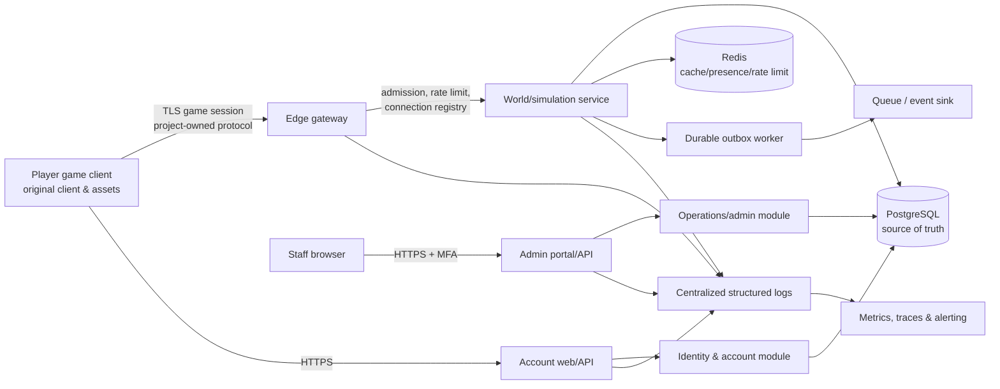

# Clean-Room Architecture for an Original 2006-Era Fantasy MMORPG

**Author:** Manus AI  
**Status:** Design baseline  
**Purpose:** Define a legally conservative, testable architecture for an **original** browser/desktop client and server that evokes broad mid-2000s fantasy-MMO design qualities without using RuneScape, Jagex, or third-party proprietary code, assets, names, data, protocols, or branding.

## Executive summary

This design recommends a **server-authoritative, protocol-separated modular monolith** for the initial release: a native or web-rendered game client connects over a purpose-built, versioned game protocol to a gateway and simulation service; browser-facing account and administration applications use a separate HTTPS API. PostgreSQL is the system of record for identity, durable character state, economy records, and administrative audit data. A cache and queue are optional supporting services, not authorities for player state.

The intended visual direction is **original low-poly, tile-based fantasy art** created by the team or licensed specifically for the project. The project must treat all recognizable RuneScape/Jagex elements—including names, logos, characters, maps, quests, dialogue, item art, music, UI layouts, proprietary client behavior, asset archives, and network formats—as excluded material. No reverse engineering, decompilation, capture/reuse of protected protocol traffic, circumvention of controls, or redistribution of proprietary assets belongs in this plan. A lawyer familiar with the target jurisdictions should review the project name, visual identity, gameplay documentation, licensing chain, and launch materials before public release.

The architecture places **all rules that affect fairness or persistence on the server**, uses an explicit protocol contract rather than an imitation of any legacy protocol, and supports local development through containers, seeded test data, disposable worlds, and repeatable migrations. Release artifacts are reproducible where practical, checksummed, accompanied by a software bill of materials (SBOM), and signed/provenanced. The testing strategy layers deterministic simulation tests, protocol contract tests, database integration tests, fuzzing, load tests, and end-to-end acceptance tests.

> **Decision:** Build an original game, not a compatibility client or private-server emulator. “2006-era” is a visual and interaction reference only; it is not a source of code, content, binary formats, network messages, or product identity.

## 1. Scope, legal boundary, and clean-room operating model

### 1.1 Allowed and prohibited inputs

The team should establish a written clean-room policy before implementation. The product requirements document may describe **generic, independently designed** features—for example, tile movement, point-and-click interaction, a skills system, an isometric or fixed-camera view, and a stylized low-polygon environment. It must not prescribe copied names, exact progression curves, geography, dialogue, quest solutions, UI artwork, music, models, or behavior derived from non-public proprietary material.

| Area | Permitted approach | Explicitly excluded from the project |
|---|---|---|
| Source code | New code written by the team; appropriately licensed open-source dependencies with notices and license review. | Decompiled code, copied snippets, leaked source, client patches, private-server source derived from proprietary materials, or code obtained by circumventing protection. |
| Art and audio | Commissioned original work, team-created work, or assets with documented commercial rights; original style guide and production files. | Jagex/RuneScape assets, extracted caches, screenshots used as production textures, copied music/SFX, avatars, maps, icons, fonts, or UI components. |
| Game design | Original world bible, names, fiction, items, mechanics, balancing, quests, and level layouts; general genre conventions. | RuneScape lore, terminology, quest text, NPCs, map layouts, item lists/icons, exact formulas, dialogue, or content reconstructions. |
| Network and data formats | A newly designed protocol and schemas documented by this project, with new message identifiers and serializers. | Capturing, reproducing, translating, or emulating any proprietary client/server protocol, cache format, file format, handshake, encryption scheme, opcode map, or updater behavior. |
| Branding and marketing | Distinct title, logo, domain, store description, and “not affiliated with” statement where counsel approves. | “RuneScape,” “Jagex,” confusingly similar product names, logos, official-looking pages, or claims of compatibility/continuation. |

This table is a design-control measure, not a legal opinion. Copyright, trademark, database, contract, and anti-circumvention rules vary by jurisdiction. Obtain counsel before release and when accepting any code or art from contributors who may have handled restricted material.

### 1.2 Evidence of independent creation

Maintain an **asset and code provenance register**. Every production asset should have an immutable identifier, creator or licensor, creation date, source files, license/assignment, permitted uses, and reviewer approval. Every external dependency should be version-pinned and license-reviewed. Preserve design histories, briefs, sketches, commits, build records, and approvals to document independent development.

Use role separation for higher-risk content. A contributor who has reverse engineered, extracted, or retained proprietary materials should not supply implementation specifications or art references for this project. Specifications should be written from the team’s original world bible and ordinary genre research. Repository contribution rules should require contributors to affirm that submissions are original or properly licensed and do not include proprietary game assets or derived work.

### 1.3 Original creative direction

Create a project-specific **world bible** before content production. It should define a unique setting, visual language, faction names, material palette, creature silhouettes, camera framing, HUD design, sound palette, and core activity loop. Keep a “do-not-use” appendix for names, terms, motifs, visual compositions, and content structures identified by counsel or the art director as too close to known works. Art review should include a similarity check against the project’s own banned-reference list, but should not source or extract third-party assets to do so.

## 2. Architectural goals and constraints

The initial architecture should optimize for predictable correctness and rapid iteration rather than premature service fragmentation. A **modular monolith** means one deployable game-service codebase with strongly isolated modules and interfaces. It is easier to test transactions, evolve schema, and operate locally than a distributed system, while retaining boundaries that allow future extraction.

| Goal | Architecture response | Success measure |
|---|---|---|
| Fair multiplayer state | Server validates movement, inventory, combat, world actions, and rewards; client is a presentation/input endpoint. | Forged or replayed client messages cannot create items, damage targets, or alter currency. |
| Protocol independence | New versioned message schema, project-owned identifiers, contract tests, and capability negotiation. | A client and server built from the public project contract interoperate without any legacy protocol knowledge. |
| Secure accounts | HTTPS account service, strong password hashing, throttling, recovery controls, server-side sessions/tokens, optional MFA for staff. | Credential, session, and privilege tests pass; no plaintext password/token in storage or logs. |
| Durable state | PostgreSQL transactions, append-only economic ledger/audit events, migrations, backups, and restore drills. | Crash/retry cannot duplicate or lose a committed inventory/economy action. |
| Safe operations | Separate admin application, least-privilege roles, step-up authentication, immutable audit trail, dual control for high-risk actions. | Every privileged mutation is attributable, reviewed where required, and reversible when designed to be reversible. |
| Small-team local workflow | Containerized dependencies, one-command bootstrap, seeds, fixtures, and disposable test environments. | A new developer can run client, services, database, tests, and a sample world without production credentials. |
| Trusted releases | Locked dependencies, SBOM, signed artifacts, checksums, release manifests, and build provenance. | Users can verify that an installer/update bundle corresponds to a reviewed source revision. |

## 3. Recommended logical architecture

### 3.1 Components and trust zones

The runtime has three externally visible surfaces: the game protocol endpoint, the account/customer website API, and the staff administration portal. These are deliberately separate. The game client never receives database credentials, signing keys, staff APIs, or authorization logic. The game protocol endpoint is not an HTTP admin endpoint.



The **edge gateway** terminates TLS, applies connection/IP/account rate limits, performs protocol version and capability admission, and forwards only authenticated, validated frames to the simulation process. It must not decide combat, inventory, or other game rules. The **world/simulation service** owns authoritative simulation ticks and game command handling. The **identity/account module** owns account lifecycle and sessions. The **operations/admin module** is a separate browser-facing backend with privileged authorization and an audit trail. PostgreSQL holds durable records. Redis may hold expiring session/presence/rate-limit data but must be reconstructible from durable state.

For an early release, identity, world, and operations modules may run within two deployables—`web-api` and `game-server`—as long as their APIs, tables, roles, and code modules remain distinct. Do not introduce microservices merely to look scalable. Extract a module only when independent operational scaling, fault isolation, ownership, or release cadence requires it.

### 3.2 Suggested repository layout

Use a monorepo to share types and test fixtures without creating an implicit runtime dependency between clients and server internals.

```text
2006scape-build/                     # rename to an original project name before release
  docs/                               # ADRs, world bible, protocol and runbooks
  contracts/                          # versioned .proto/.json schema; no proprietary formats
  apps/
    game-client/                      # renderer, UI, input, local prediction only
    game-server/                      # gateway + world modules
    web-api/                          # accounts, launcher metadata, support endpoints
    admin-portal/                     # staff UI, no player-client routes
    worker/                           # outbox consumers, scheduled maintenance
  packages/
    domain/                           # pure rules and value objects
    protocol/                         # generated codecs and contract validation
    content/                          # original definitions and asset manifests
    observability/                    # redacting structured logging/metrics
  db/
    migrations/ seeds/ fixtures/
  infra/
    compose/ terraform-or-equivalent/ deployment-manifests/
  tests/
    e2e/ load/ fuzz/ security/
  legal/
    asset-register/ dependency-notices/ contributor-policy.md
```

The client may be a desktop executable, a browser client, or both. A desktop-first client is often simpler for low-level rendering and update control; a web client simplifies reach but increases browser/platform constraints. This decision does not affect the protocol boundary. Whichever is selected, bundle only original/licensed assets and project-owned code.

## 4. Game protocol and simulation boundary

### 4.1 Protocol principles

Design a project-owned protocol from a new schema. Use a binary framing format such as Protobuf, FlatBuffers, or a compact custom codec **only after** documenting it. JSON over WebSocket is acceptable for early development and can be replaced behind the same contract boundary. All network traffic should use TLS. A message should contain a protocol major/minor version or negotiated capability set, a frame type, bounded payload length, a monotonically scoped request/sequence identifier when relevant, and a correlation identifier for diagnostics.

The client sends **intent**, not state assertions. For example, `MoveIntent(destinationTile)`, `InteractIntent(entityId, actionId)`, and `UseItemIntent(itemInstanceId, target)` are requests. The server validates identity, session, character ownership, current tick, range, cooldown, map collision, target state, item ownership, and all rule preconditions. It then mutates authoritative state and emits a snapshot/delta or rejection. Never accept `setGold`, `setPosition`, `applyDamage`, XP totals, or inventory contents from the client.

| Concern | Required design |
|---|---|
| Versioning | Handshake advertises supported protocol version/capabilities. Reject incompatible clients with an update message. Maintain a compatibility matrix and sunset date; never guess message layouts. |
| Framing | Fixed maximum frame size, strict length checks, timeouts, back-pressure, message-rate limits, and allocation limits before decode. |
| Authentication | Authenticate at admission using a short-lived, audience-bound game ticket minted by the account service; consume the ticket once and bind it to the connection. |
| Authorization | Resolve account/character/server shard on the server. Every command checks ownership and authorization in the domain handler. |
| Ordering/idempotency | Use client command IDs only where a user retry can occur. Persist/reconcile critical command results; scope sequence numbers per connection. |
| Time and ticks | The server owns time. Client timestamps are advisory telemetry only. Process deterministic simulation at a fixed tick; queue commands for a tick window. |
| Error handling | Return coarse player-safe error codes. Log detailed reason codes internally. Do not expose stack traces, schema internals, or staff-only information. |
| Observability | Add protocol version, frame type, outcome, latency, and redacted correlation ID to structured telemetry; do not record credentials or raw sensitive payloads. |

### 4.2 Simulation design

Model the world as shard/instance-owned actor loops. Each shard owns the mutable in-memory state for its loaded regions and advances at a fixed tick rate. Route a character to exactly one shard at a time. Serialize cross-shard transitions through a handoff workflow rather than sharing mutable objects. Entity identifiers are opaque 128-bit or UUID-like IDs generated by the server; do not make them sequential database keys exposed to clients.

The server uses deterministic domain functions where practical: `validateMove`, `resolveInteraction`, `resolveCombatRound`, and `awardReward`. RNG must be server generated, recorded or seeded with a traceable event ID for dispute resolution, and never accepted from the client. Separate **content definitions** (versioned original JSON/data packages) from player state. Pin a region/instance to a content revision during a session so hot reload cannot make a live rule evaluation ambiguous.

Use client-side interpolation and optionally local movement prediction strictly to improve responsiveness. The server remains the authority and sends correction snapshots. Prediction code should be designed so a malicious client gains no advantage if it is removed or altered.

### 4.3 Contract-first delivery

The protocol package contains schema source, generated client/server codecs, golden frame fixtures, compatibility tests, and documentation for each message. Version source artifacts alongside code, publish only the project’s original schema, and treat a schema change as an API change with an architecture decision record (ADR). Do not infer schemas by observing another game or attempt to make the client communicate with third-party servers.

## 5. Identity, authentication, and player safety

### 5.1 Account and session model

The account service exposes HTTPS endpoints for registration, sign-in, email verification, password reset, device/session listing, logout, and optional account recovery. It issues a short-lived access token or opaque server-side session for the website plus a short-lived, one-time game-admission ticket for the gateway. Keep website sessions distinct from game connections. The gateway validates ticket signature/audience/expiry and atomically marks a ticket consumed before starting a game session.

Passwords must never be stored or logged in plaintext. Store a per-password salted **Argon2id** verifier; OWASP currently recommends at least 19 MiB memory, two iterations, and one lane as a minimum baseline, then tune and periodically recalibrate against the deployed hardware and denial-of-service budget [2]. Store a password pepper, if used, separately in a secret manager rather than in the database. NIST guidance calls for effective rate limiting of consecutive failed authentication attempts [1]. Apply rate limits by account, IP/network signal, and device/session signal with careful user messaging and support recovery to avoid trivial account lockout attacks.

| Control | Player account | Staff account |
|---|---|---|
| Primary login | Password over HTTPS; passkeys can be added after a usability/security review. | Enterprise identity provider or dedicated staff accounts with phishing-resistant MFA preferred. |
| Password storage | Argon2id salted verifier; optional secret-manager pepper; rehash on login when parameters increase. | Same or identity-provider managed; no shared accounts. |
| Session | Secure, HttpOnly, SameSite cookie or opaque token; short idle and absolute expiry; rotate on authentication/privilege change. | Shorter expiry, device/session visibility, step-up reauthentication for sensitive actions. |
| Game admission | Short-lived single-use ticket bound to account, character choice, audience, and client/protocol version. | No game-ticket access conveys administrative rights. |
| Recovery | Verified email workflow with rate limits, notification, delayed/high-risk safeguards, and support escalation. | Break-glass process, dual approval, alerting, and post-event review. |

Sessions should have server-enforced idle and absolute expirations, logout/revocation support, and rotation after authentication or privilege changes. OWASP recommends logging session creation, renewal, destruction, privileged changes, timeouts, and critical operations while avoiding the session identifier itself; a salted hash can support correlation without disclosing the token [3]. Do not place long-lived bearer tokens in URLs, game logs, browser local storage, screenshots, or crash reports.

### 5.2 Authorization and abuse controls

Use deny-by-default authorization with explicit roles and permissions. Player-facing authorization must be resource-specific: a player can access only their own account, characters, cosmetic inventory, support tickets, and permitted social data. Staff authorization must use role-based access control (RBAC) and, where necessary, attribute/approval conditions. Keep “support view,” “moderator,” “game master,” “economy operator,” “content publisher,” “security reviewer,” and “super-admin” separate. Grant temporary elevated roles with expiration rather than permanent broad privileges.

Rate-limit registration, login, password recovery, game ticket creation, connections, chat, trading, and expensive world actions. Distinguish an anti-abuse flag from an irreversible ban decision. Automatically generated detections should be reviewable, minimally invasive, time-limited, and auditable. Do not use invasive client surveillance or undisclosed collection as a substitute for server authority and rate limiting.

## 6. Persistence, consistency, and recovery

### 6.1 Data ownership and schema

PostgreSQL is the durable source of truth. Use migrations checked into version control, immutable primary keys, foreign keys for core ownership, timestamps in UTC, and optimistic concurrency/version fields on player aggregates. Use parameterized queries or an ORM that preserves parameters; never concatenate user/game input into SQL. Database credentials are scoped by service: the game server cannot directly grant administrative roles; the read-only analytics role cannot modify live state.

Suggested durable aggregates are `account`, `credential`, `session`, `character`, `character_location`, `inventory_item`, `equipment`, `skill_progress`, `quest_state`, `world_instance`, `trade`, `economic_ledger`, `moderation_case`, `admin_action`, `asset_provenance`, and `outbox_event`. Avoid a generic unstructured blob for all character state. Structured columns make integrity constraints, migrations, backups, and forensic review possible. A JSON column is appropriate only for versioned, bounded extension data with a documented schema.

### 6.2 Transaction patterns

For every critical state mutation, use a short database transaction that validates the aggregate version, applies the state change, writes an auditable domain event, and inserts an outbox event in the same commit. A worker publishes outbox records after commit and retries safely. This avoids claiming success to the player before durable state exists and avoids lost integration events on process failure.

Transfers, trades, purchases, awards, and item destruction require special handling. Lock the relevant rows in a stable order or use a serializable/retryable transaction; enforce uniqueness and balance constraints in the database as well as in domain code. PostgreSQL’s serializable mode provides the strongest transaction isolation but applications must retry full transactions after serialization failures [4]. A user-facing command therefore needs an idempotency key and a well-defined retry result. Never implement economy correctness through cache writes or asynchronous “eventual” updates alone.

| Data class | Storage and consistency | Recovery policy |
|---|---|---|
| Account, credential, entitlement | PostgreSQL; durable transaction. | Encrypted backups; test restoration; minimize personal data. |
| Character/inventory/economy | PostgreSQL aggregate plus append-only domain/economy ledger and outbox. | Point-in-time recovery and ledger-assisted investigation; no manual database edits outside incident procedure. |
| Live region position/presence | Shard memory and Redis with periodic/safe-point persistence to PostgreSQL. | Disconnect/reload from last valid saved state; reconcile pending command IDs. |
| Cache/rate limit | Redis with TTL, non-authoritative. | Rebuild/reset on loss; service remains correct without cache. |
| Logs/audit | Central protected append-oriented log store and administrative audit table. | Retention policy, access restriction, integrity monitoring, and legal/privacy review. |
| Content definitions | Versioned signed content package and asset manifest. | Roll back to prior content revision; retain exact revision used by each release. |

### 6.3 Backups and incident recovery

Perform encrypted database backups with documented retention, least-privilege backup access, and regular restore drills to an isolated environment. Define recovery point objective (RPO) and recovery time objective (RTO) before launch. Example starting targets are RPO of 15 minutes and RTO of four hours, but validate these against budget and player expectations. A backup is not accepted as working until a scheduled restore drill verifies schema, representative character records, and application startup.

Use a written incident runbook for duplicate-item reports, compromised accounts, bad content deployments, data corruption, and service outage. Favor compensating transactions and explicit remediation events over editing historic rows. Emergency direct database access must be limited, time-bound, logged, and reviewed.

## 7. Administration, moderation, and observability

The admin portal is a separate application on a separate hostname and API route group. It is not compiled into or reachable through the game client. It must be protected by MFA, least-privilege RBAC, network/WAF controls where appropriate, session timeout, CSRF protection for browser sessions, and step-up reauthentication for high-impact commands. Production staff access should go through a recorded change/incident process.

| Admin capability | Required guardrails | Audit record |
|---|---|---|
| Player lookup/support | Mask sensitive data by default; require case/ticket reason; prohibit plaintext credential access. | Staff ID, purpose, searched identifier hash, fields revealed, timestamp. |
| Moderation | Evidence reference, policy reason, expiration/review date, appeal state. | Actor, rule/case ID, action, target, reason, before/after status. |
| Item/currency grant or removal | Narrow permission; two-person approval above threshold; idempotency key; ledger entry. | Requester, approver, target, amount/item, reason, linked ledger/event IDs. |
| Character repair | Documented playbook, preview/dry run, rollback/compensating action where possible. | Actor, approval, diff, operation result, correlation ID. |
| Content publish | Signed reviewed package; staging validation; canary/rollback plan. | Content hash, revision, approver, deployment environment, rollback event. |
| Role/access changes | Separate identity-admin permission and approval for high privilege. | Grantor, recipient, old/new role, expiry, approval, session/device details. |

Logs must be structured, centrally collected, protected from ordinary application users, time-synchronized, and reviewed by alerts. Application security logs are essential; infrastructure logs alone are insufficient [6]. Sanitize untrusted fields against log injection and never record passwords, access tokens, session IDs, database strings, encryption keys, or unnecessary personal data [6]. Treat audit records and telemetry as different products: audit data must support “who did what and why,” while operational logs support debugging and alerting.

Expose operational metrics: active connections, admission failures, tick duration, command queue depth, database pool saturation, transaction retry rate, outbox lag, cache health, error rate, content revision, and moderator/admin action rate. Instrument traces across account ticket issuance, gateway admission, command processing, persistence, and outbox delivery using redacted correlation IDs.

## 8. Local development and deployment topology

### 8.1 Local developer experience

Provide a `make dev` or `docker compose up` workflow that starts PostgreSQL, Redis, a local object-store emulator if used, game server, web API, admin portal, and optional observability collector. It must use only local development secrets created at bootstrap. Do not copy production dumps or credentials into developer machines. A seed package should create fictional test accounts, test characters, original placeholder content, an isolated test world, and staff roles that are invalid outside local development.

| Command/workflow | Expected result |
|---|---|
| `make bootstrap` | Installs pinned tooling, creates `.env.local` from a non-secret template, and creates local development secrets. |
| `make dev` | Starts the full disposable stack with health checks and file-watch/reload where safe. |
| `make db-reset` | Drops and recreates the local database, applies migrations, and seeds synthetic data. Never targets a non-local database. |
| `make test` | Runs unit, contract, and integration tests with disposable services. |
| `make e2e` | Runs two or more synthetic clients through registration/login/admission/basic world interaction. |
| `make content-validate` | Validates asset manifest ownership fields, content schemas, reference integrity, size budgets, and forbidden-name checks. |
| `make release-check` | Verifies a clean tree, migrations, lockfiles, tests, SBOM, license report, asset register completeness, build/signature/provenance requirements. |

Use a distinct `development`, `test`, `staging`, and `production` configuration. Validate configuration at startup; require an explicit environment name and refuse unsafe combinations such as `DB_HOST=production` under development mode. Store real secrets only in a managed secret store in staging/production and inject them at runtime. Do not commit `.env` files, signing keys, private certificates, customer data, or creator license documents intended to remain private.

### 8.2 Environments and release flow

CI should build immutable artifacts once, run tests, publish artifacts to a private registry, deploy the exact artifact to staging, execute smoke/contract tests, then promote the same digest to production after approval. Database migrations follow an expand–migrate–contract process: add backwards-compatible schema, deploy code that supports both shapes, backfill/verify, then remove old columns only after all old binaries are gone. Feature flags are server-controlled, bounded in lifetime, auditable, and never a way to hide unreviewed changes.

Network segmentation should limit database access to application services and controlled administrative paths. Only public TLS endpoints receive internet traffic. Monitoring, build, and backup identities need separate credentials. Run workloads as non-root with read-only filesystems where feasible, minimal container images, resource limits, and regular dependency vulnerability review.

## 9. Packaging, updates, and software supply chain

The client updater and distribution process must distribute only the project’s original code and licensed assets. Release each platform bundle with a versioned manifest containing artifact name, SHA-256 digest, file size, content-pack hashes, minimum protocol version, release notes, and signing-key identity. Sign installers/binaries using the appropriate platform signing mechanism where available; sign update manifests and verify them in the client before download/install. Do not silently execute arbitrary update scripts.

Generate an SBOM for each server/container/client release. Keep dependency lockfiles, perform license policy checks, scan for known vulnerabilities, and review new direct dependencies. Preserve build provenance: SLSA describes provenance as verifiable information about where, when, and how an artifact was produced so users can verify expectations or rebuild it [5]. At minimum, record source commit, clean/dirty state, dependency lockfile digest, builder identity, build command, timestamps, artifact digest, and content asset manifest digest. Retain release artifacts so an incident can reproduce the exact client/server/content combination.

| Release artifact | Required metadata and control |
|---|---|
| Desktop client/install package | Platform signature where supported, SHA-256, signed update manifest, original asset manifest/hash, protocol compatibility range, SBOM. |
| Browser client | Immutable content-hashed assets, HTTPS, Content Security Policy, release manifest, SRI where appropriate, deployment commit/digest. |
| Game server container | Pinned base image digest, non-root user, image digest/signature, SBOM, migration compatibility declaration, provenance. |
| Content package | Semantic content revision, source-asset provenance IDs, schema validation result, reviewer/approver, signed package hash, rollback target. |
| Database migration | Ordered ID, checksum, forward/rollback or compensating plan, staging verification, owner and approval. |

Use a staged updater rollout with error monitoring and a kill/rollback mechanism. Retain compatible server support for the immediately prior approved client version for a bounded period, or require a signed update before admission. If a signing key is compromised, revoke it through a predesigned key-rotation mechanism and publish a signed incident/recovery notice through independent verified channels.

## 10. Test strategy and quality gates

A game client/server system needs tests at domain, protocol, persistence, operational, and security boundaries. Make deterministic tests inexpensive enough to run for every change. Use synthetic test assets and accounts only. Tests must not use proprietary game binaries, archives, captured traffic, or content.

| Test layer | What it proves | Examples | CI gate |
|---|---|---|---|
| Unit/domain | Rules are deterministic and reject invalid state. | Movement collision, cooldowns, combat calculation, inventory capacity, trade invariants, permission checks. | Every commit. |
| Property-based | Invariants hold across generated inputs. | Item count never negative; command replay is idempotent; player cannot own an item twice; encoders/decoders round-trip. | Every commit/nightly depending cost. |
| Protocol contract | Client/server agree on the project-owned schema. | Golden frame decoding, version negotiation matrix, unknown-field behavior, frame limits. | Every commit; release compatibility report. |
| Fuzz/security | Decoders and APIs fail safely under hostile input. | Truncated/oversized frames, malformed varints, replayed tickets, invalid UTF-8, log injection strings, auth throttling. | Continuous/nightly; blockers for crash/auth bypass. |
| Integration | Transactions and external dependencies preserve correctness. | Concurrent trade/purchase, serialization retry, outbox delivery, migration upgrade, Redis loss. | Pull request and release. |
| End-to-end | Real clients complete supported journeys. | Register, verify, login, obtain ticket, connect, move, interact, logout, reconnect. | Staging and release. |
| Load/soak | Capacity and degradation are understood. | Thousands of simulated connections, tick budget, admission burst, database saturation, 24-hour soak. | Milestone/release. |
| Restore/chaos | Recovery objectives are real. | Restore backup, shard restart during mutation, queue outage, cache flush, failed migration rehearsal. | Scheduled and before major release. |
| Accessibility/usability | Original UI can be used by the intended audience. | Keyboard navigation, readable contrast, scalable text, clear error/recovery states. | Major UI changes. |
| Legal/provenance | Release inputs are authorized and traceable. | Asset register completeness, forbidden-reference scan, dependency license report, contributor attestations. | Every release; content-publish gate. |

Security verification should include authenticated authorization regression tests, secret scanning, dependency scanning, static analysis, code review, threat-model review for boundary changes, and independent penetration testing before a public launch. Test logging itself: OWASP recommends verifying that logging works, resists injection, handles failures, preserves access controls, and does not exhaust resources [6].

## 11. Delivery plan

### Phase 0 — Foundation and legal hygiene

Approve the project’s original title and visual direction; appoint an owner for the asset register; write contributor rules; establish source control, dependency policy, and a clean-room training/attestation. Produce original placeholder art and a world bible. Implement the build, local stack, schema migration runner, CI, logging redaction, and baseline threat model before content scale-up.

### Phase 1 — Vertical slice

Deliver a single original region with two original player archetypes, movement, one interaction type, account registration/login, one-time game admission ticket, server-authoritative simulation, PostgreSQL character persistence, a minimal read-only support lookup, and end-to-end tests. Use placeholder content only if its provenance is documented. Prove the update manifest and artifact verification early.

### Phase 2 — Durable gameplay and operations

Add inventory, combat, skill progression, social functions, economy/trade if desired, moderation workflow, admin approval controls, audit trails, backups, dashboarding, staging deployment, load testing, and recovery drills. Keep high-value economy mutations ledgered and transactionally correct before expanding content.

### Phase 3 — Launch readiness

Complete legal review of name/branding/assets/marketing, independent security review, accessibility/usability review, SBOM and provenance verification, restore exercise, capacity test, incident simulations, key-rotation rehearsal, and a production go/no-go checklist. Release progressively and monitor admission, ticks, errors, economy anomalies, and update health.

## 12. Architecture decision record (ADR) checklist

Create an ADR for changes to protocol versioning, client platform, authentication/token format, shard topology, persistence model, economy rules, third-party dependency introduction, telemetry collection, updater signing, content-package format, and production access. Each ADR should state the decision, alternatives, consequences, rollback plan, security/privacy impact, test plan, and legal/provenance impact.

Before merging any feature, ask: **Is the code/content independently created or properly licensed? Does the server remain authoritative? Is the protocol project-owned? Are permissions least-privilege? Is state transactionally safe? Are secrets/redaction/audit paths covered? Can the change be tested, deployed, and rolled back?**

## Conclusion

A legally safer 2006-era-inspired MMO is achievable by treating “inspired” as a high-level aesthetic and interaction constraint, not as a compatibility target. The design should begin with original creative materials and a clean-room evidence trail, then enforce a new protocol boundary, server-authoritative rules, secure account lifecycle, transactionally durable state, auditable staff controls, repeatable local environments, verifiable packages, and layered tests. This produces a game that is independently operable and technically maintainable without depending on, copying, bypassing, or redistributing proprietary Jagex/RuneScape materials.

## References

[1]: https://pages.nist.gov/800-63-4/sp800-63b.html "NIST SP 800-63B: Digital Identity Guidelines—Authentication and Authenticator Management"
[2]: https://cheatsheetseries.owasp.org/cheatsheets/Password_Storage_Cheat_Sheet.html "OWASP Password Storage Cheat Sheet"
[3]: https://cheatsheetseries.owasp.org/cheatsheets/Session_Management_Cheat_Sheet.html "OWASP Session Management Cheat Sheet"
[4]: https://www.postgresql.org/docs/current/transaction-iso.html "PostgreSQL Documentation: Transaction Isolation"
[5]: https://slsa.dev/spec/v1.2/build-provenance "SLSA Build Provenance v1.2"
[6]: https://cheatsheetseries.owasp.org/cheatsheets/Logging_Cheat_Sheet.html "OWASP Logging Cheat Sheet"
