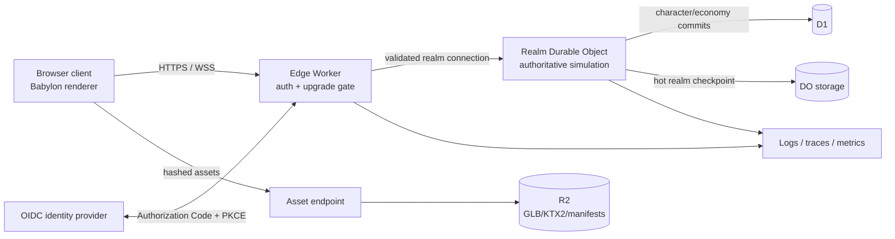
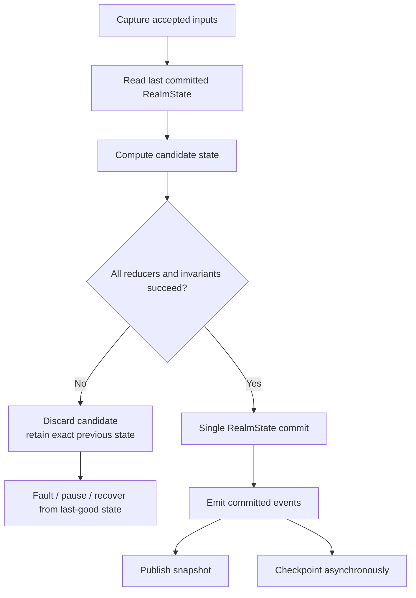
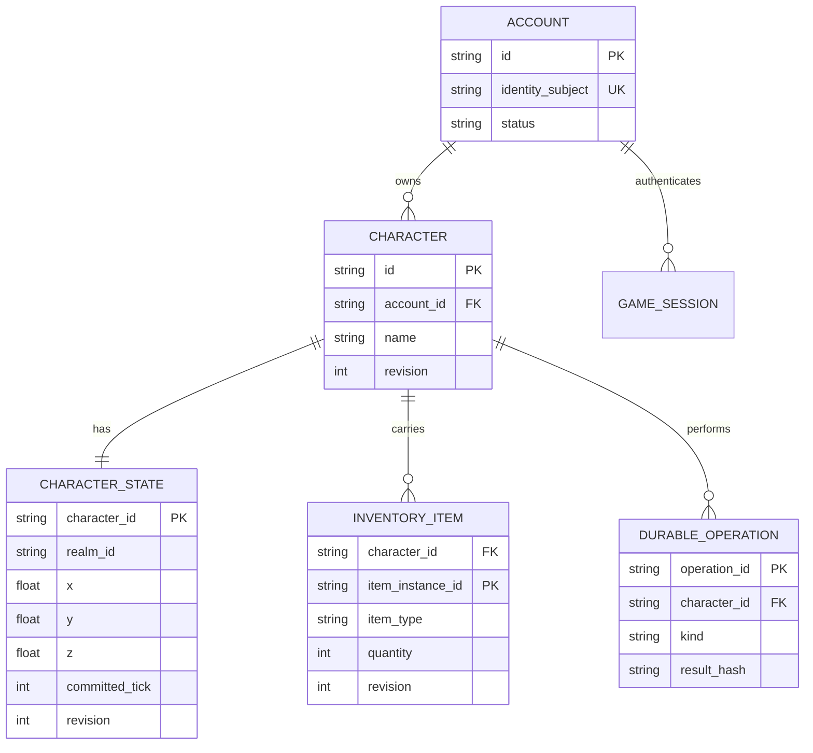

# Wayfarer v0.8 End-to-End Multiplayer MMORPG Consolidation Report

## Executive summary and release assumptions

Wayfarer should treat **v0.8 as a consolidation release, not another feature accumulation release**. The existing v0.1–v0.7.9-abc artifacts already contain most of the necessary pieces—server-owned movement, local WebSockets, protocol compatibility checks, interpolation, world/atlas work, Babylon rendering, cosmetic cloth, the multitool, ABC wind fields, Python validation, and a growing test suite—but they are not yet one production system. Based on the supplied artifacts and the previously reproduced failure, the highest-risk gap is still simulation atomicity: v0.7.1 prevented a faulted realm from publishing an inconsistent snapshot, but a later player failure can occur after an earlier player has already mutated internally. **v0.8 must replace “fault after partial mutation” with an atomic stage/validate/commit tick.**

The recommended v0.8 reference architecture is: **browser Babylon client → Cloudflare Worker edge/authentication gateway → one Durable Object per active realm/zone → D1 for durable account/character/economy records → R2 for immutable content and large artifacts**. Cloudflare explicitly positions Durable Objects as coordinators for multiple WebSocket clients, including multiplayer use cases, and its Hibernation WebSocket API can preserve connections while an idle object leaves memory. Active timers prevent hibernation, however, so an actively ticking Wayfarer realm should intentionally remain awake and stop its tick loop when the last player leaves. citeturn15view0

The v0.8 release gate should therefore consist of six non-negotiable outcomes:

1. **Every simulation tick is atomic.** A failure while stepping any entity leaves *every* entity and the realm tick at the last committed state.
2. **One protocol contract governs browser, server and tooling.** Authentication, resume, input sequence acknowledgements, full/delta snapshots, errors and version negotiation are explicit.
3. **The internet-facing realm is authenticated and authorized.** The browser cannot select another player's identity or mutate authoritative state, and every WebSocket upgrade and gameplay message passes security checks.
4. **Characters survive disconnects and realm-process restarts.** Short reconnects resume the same live session; longer interruptions restore the last committed durable checkpoint without duplicating inventory/economy effects.
5. **The actual game—not just isolated labs—passes browser, WebKit, mobile, networking, visual and soft-body tests.**
6. **The final v0.8 artifact is reconstructible.** The historical ZIPs are inventoried rather than rewritten into fictional Git history; the v0.8 tag, lockfiles, migration files, asset manifest, checksums and deterministic ZIP procedure form the new trustworthy baseline. Reproducible-build practice is specifically intended to create an independently verifiable path from source to output. citeturn14search2

**Release naming assumption:** there is exactly one public **v0.8**. There are no v0.8.1, v0.8.2, and so on. All necessary corrections happen on `release/v0.8` before the tag. After release, development moves directly to v0.9.

**Project assumptions used in this report:** the supplied v0.7.9-abc artifact is the starting source tree; earlier ZIPs remain available for provenance inspection; the current 20 Hz authoritative tick and roughly 10 Hz snapshot cadence are retained initially; v0.8 is an authenticated persistent multiplayer *MMORPG foundation/playable slice*, not a claim of untested mass concurrency; Cloudflare is the reference production target but the simulation core remains provider-independent; no particular identity provider is mandated; JSON remains the v0.8 wire encoding unless profiling proves it inadequate; and gameplay-critical soft-body physics is not introduced during this consolidation.

Effort estimates below are engineering-size estimates rather than calendar promises: **S** ≈ up to one engineer-day, **M** ≈ two to five engineer-days, and **L** ≈ approximately one to two focused engineer-weeks, depending on integration surprises.

## Target architecture and simulation integrity

The cleanest architecture is to place a hard boundary between the **deterministic domain core** and all I/O. The simulation package should know nothing about Cloudflare, WebSockets, D1, R2, cookies, Babylon or the browser. That permits the exact same tick/replay tests to run in Node CI, a local server, a Durable Object and, if desired later, a Rust/Wasm helper.



RFC 6455 defines WebSocket as an HTTP opening handshake followed by bidirectional framed communication and uses the browser origin security model; Cloudflare's documented Durable Object pattern is for the Worker to validate/proxy the upgrade and the Durable Object to accept the server side of the connection. citeturn11search24turn15view0

**Authoritative server model.** Preserve the correct principle already present in Wayfarer: the client submits **intent**, not outcomes. A movement message may say “my latest input direction is `(x,z)` with sequence 1842”; it must never say “my new position is `(41,72)`.” Position, speed, collision, arrival validity, realm membership, inventory, damage, currency and interaction results belong to the authoritative realm.

The core should be reorganized approximately as:

```text
src/
  sim/
    realm-state.ts
    tick.ts
    movement.ts
    terrain-query.ts
    invariants.ts
    replay.ts
  protocol/
    generated/
    codec.ts
  client/
    net/
    presentation/
    physics/
  cloud/
    worker.ts
    realm-object.ts
    persistence/
```

The central rule is:

```ts
export interface RealmState {
  readonly tick: number;
  readonly epoch: string;
  readonly players: ReadonlyMap<PlayerId, PlayerState>;
  readonly worldRevision: number;
}

export interface TickResult {
  readonly state: RealmState;
  readonly events: readonly RealmEvent[];
}

export function stepRealm(
  previous: RealmState,
  inputs: ReadonlyMap<PlayerId, PlayerIntent>,
  world: ReadonlyWorldQuery,
): TickResult {
  const nextPlayers = new Map<PlayerId, PlayerState>();

  for (const [id, player] of previous.players) {
    // Pure: returns a new PlayerState. It does not mutate `player`.
    nextPlayers.set(
      id,
      stepPlayer(player, inputs.get(id), world, FIXED_DT_SECONDS),
    );
  }

  const candidate: RealmState = {
    ...previous,
    tick: previous.tick + 1,
    players: nextPlayers,
  };

  assertRealmInvariants(candidate);

  return {
    state: candidate,
    events: deriveCommittedEvents(previous, candidate),
  };
}
```

The runtime then has **one state mutation point**:

```ts
advance(): void {
  const previous = this.state;

  try {
    const accepted = this.inputBuffer.consumeForTick(previous.tick + 1);
    const result = stepRealm(previous, accepted, this.world);

    // Atomic logical commit.
    this.state = result.state;

    // Only committed state can generate externally visible effects.
    this.publishCommittedEvents(result.events);
    this.maybePublishSnapshot();
    this.scheduleCheckpoint();
  } catch (error) {
    // previous remains the exact live state.
    this.enterFaultBoundary(error, previous);
  }
}
```

This directly fixes the reproduced tick defect. `WorldSession.tick()` must no longer loop over mutable `ServerWalker` objects whose `advance()` calls modify them in place. Either replace `ServerWalker` with immutable `PlayerState`, or retain a class internally but make `step()` return a new value. **No side effect—snapshot publication, inventory effect, analytics event, save write, particle event or network send—may occur during candidate calculation.**



Terrain/world queries inside a tick must likewise be read-only and deterministic. Required terrain/chunk data should be loaded **before** a player is admitted into a region; an unavailable chunk should cause a controlled “region not ready” transition rather than an exception halfway through player iteration.

For v0.8, “rollback” should mean three deliberately separate mechanisms. **Atomic tick rollback** is mandatory and is implemented by discarding an uncommitted candidate. **Client reconciliation** is required only for client-predicted movement: when an authoritative snapshot acknowledges input sequence `N`, the client resets to the server position and replays still-unacknowledged inputs `N+1…current`. **Historical server rewind/lag compensation** should be deferred to v0.9 unless v0.8 introduces latency-sensitive combat; it adds a different class of complexity and is not needed to solve the existing tick bug.

Snapshots should become explicit protocol objects:

```ts
interface StateSnapshot {
  t: "state.snapshot";
  serverTick: number;
  snapshotId: number;
  baseSnapshotId?: number;   // absent => full snapshot
  ackInputSeq: number;
  sessionEpoch: string;
  entities: EntitySnapshot[];
}
```

On initial join, resume after uncertain state, contract mismatch recovery, or a missing delta base, the server sends a **full** snapshot. Normal operation may then send interest-filtered deltas. The existing ~100 ms interpolation concept remains appropriate for remote players; do not extrapolate remote characters forever when snapshots stop. The renderer should freeze or transition them into a network-stalled presentation after a bounded interval.

**Acceptance tests for this stratum are exact, not subjective:**

| Simulation test | Required result |
|---|---|
| Failure while stepping first player | Realm tick, every player position/tick and published snapshot remain unchanged |
| Failure while stepping second, middle or final player | Same atomic result; specifically closes the reproduced defect |
| Invariant failure after all players compute | Candidate discarded; no external event emitted |
| Same seed + initial state + input log, run 100 times | Same final canonical state hash every run |
| Inputs arrive in different callback groupings but same accepted sequence | Same authoritative outcome |
| Missing terrain prerequisite | Tick does not partially execute |
| Persistence/checkpoint write fails | Already committed simulation does not become half-reverted; failure is queued/alerted according to policy |
| Realm process/DO is reconstructed | Latest valid checkpoint loads; epoch changes; clients resynchronize |

The main risk here is accidentally retaining mutable nested objects beneath an apparently read-only `RealmState`. Mitigate it with immutable data conventions, deep-freeze assertions in tests, explicit state constructors and replay/fuzz tests. The second risk is turning tick execution into an expensive full deep clone; avoid that by allocating new records only for changed simulation state and using immutable structural boundaries rather than serializing the entire realm every 50 ms.

## Network contract, security, identity and recovery

**Transport topology.** Keep the local Node/`ws` server as a development adapter, but implement the production adapter as an edge Worker plus a realm Durable Object. Cloudflare documents Durable Objects as single coordinating instances for multiple WebSocket clients; their hibernation API keeps clients connected while idle state leaves memory, but `setTimeout`/`setInterval` and other active events prevent hibernation. Accordingly, start Wayfarer's 20 Hz simulation only while the realm has active players, and cancel it when population reaches zero. citeturn15view0

Do not infer “massively multiplayer capacity” from Cloudflare's statement that a Durable Object can hold many WebSocket connections. Simulation CPU, snapshot fan-out and interest management will constrain a game well before raw socket count in some workloads. **v0.8 should publish only the population that its soak tests prove.** Realm/zone sharding provides the future scaling boundary: `realm:willowglass:zone:03`, rather than one immortal object for the entire future world.

**Protocol contract.** Because authentication, resume and snapshot semantics materially change the current contract, do not mutate `wayfarer.realm.v1` in place. Introduce:

```text
Sec-WebSocket-Protocol: wayfarer.realm.v2
protocolVersion: 2
```

Keep `REALM-CONTRACT.json`, but make it a human-readable manifest pointing to a language-neutral normative schema tree:

```text
protocol/
  REALM-CONTRACT.json
  schema/
    envelope.schema.json
    hello.schema.json
    welcome.schema.json
    input-move.schema.json
    snapshot.schema.json
    resync.schema.json
    heartbeat.schema.json
    error.schema.json
  fixtures/
    valid/
    invalid/
```

Generate—not separately hand-maintain—TypeScript and Python contract artifacts from that normative representation. CI must regenerate and fail if `git diff` is non-empty. Python should validate test fixtures with strict Pydantic semantics rather than permissive coercion; Pydantic explicitly distinguishes strict mode from its default coercive/lax behavior. citeturn18search2

A practical v2 envelope is:

```json
{
  "pv": 2,
  "t": "input.move",
  "seq": 1842,
  "epoch": "r_01J...",
  "body": {
    "x": -0.71,
    "z": 0.71
  }
}
```

`seq` is monotonic per client session. `epoch` prevents delayed packets from a previous realm incarnation being applied after recovery. A `welcome` supplies `playerId`, `realmId`, `sessionEpoch`, `serverTick`, tick/snapshot rates, current build/asset manifest and whether resume succeeded. A snapshot returns `ackInputSeq`. Protocol errors use stable machine codes rather than matching human strings.

Reject unknown message types, wrong major versions, non-finite numbers, unexpected fields where schemas forbid them, impossible vectors, stale epochs and non-monotonic sequences. Keep the v0.7.x decision to reject arbitrary binary input unless a binary protocol is intentionally introduced later.

**Authentication and authorization.** The browser game should use an external OpenID Connect identity provider with the authorization-code flow and PKCE, then establish a Wayfarer server session. The current IETF OAuth Security BCP requires PKCE for public clients, recommends it for confidential clients, discourages implicit-token flows, requires exact redirect validation and emphasizes scope/audience restrictions. citeturn19view0

A robust browser pattern is:

```text
browser
  -> /auth/login
  -> OIDC provider
  -> /auth/callback
  -> Worker exchanges/verifies result
  -> server-side Wayfarer session
  -> Secure + HttpOnly + SameSite cookie
  -> WSS /realm/{realmId}/socket
```

The game WebSocket upgrade should authenticate from the same-origin session rather than placing long-lived access tokens in a WebSocket URL. The Worker then verifies exact `Origin`, session expiry/account status, requested subprotocol, realm admission and character ownership **before** routing to the Durable Object. OWASP specifically warns that WebSockets have no built-in application authentication, calls for explicit origin validation to prevent Cross-Site WebSocket Hijacking, recommends authorization on each action rather than only at connection time, and recommends strict schema, size and rate validation. citeturn4view0

Bind the resulting connection server-side:

```ts
interface AuthorizedConnection {
  accountId: AccountId;
  characterId: CharacterId;
  realmId: RealmId;
  capabilities: ReadonlySet<Capability>;
  sessionEpoch: string;
}
```

Then movement messages contain **no player identifier at all**. The server already knows which character that socket is allowed to control. An interaction such as `inventory.drop`, `travel.use`, `chat.send` or future combat action passes an action-specific authorization function before reaching domain logic.

Use `wss://` in production. OWASP recommends encrypted WebSockets, payload limits, message-level authorization, replay controls, heartbeat/liveness measures, flow-control protections and security-relevant event logging; it also advises against enabling WebSocket compression unless needed. citeturn4view0

**Flow control.** Replace “queue every packet and hope” with semantic queues:

| Class | Examples | Congestion behavior |
|---|---|---|
| Critical | `welcome`, auth failure, `resync`, durable action result | Preserve; disconnect if bounded queue cannot deliver |
| State | snapshots | Keep newest applicable snapshot; discard superseded unsent snapshots |
| Input | movement intent | Coalesce to newest valid intent/sequence before next tick |
| Ephemeral | cosmetic FX hints, typing indicators | Drop first under pressure |

Cloudflare recommends batching high-frequency logical messages because each WebSocket message adds runtime overhead. Its Hibernation API also automatically responds to WebSocket protocol ping frames; application-level heartbeats can still carry session/tick health and round-trip information. citeturn15view0

For v0.8, define explicit configurable budgets rather than magic literals distributed through the code:

```ts
const NET_LIMITS = {
  maxClientFrameBytes: 8 * 1024,
  maxMoveMessagesPerSecond: 30,
  burstMoveMessages: 10,
  heartbeatIntervalMs: 15_000,
  livenessTimeoutMs: 45_000,
  handshakeDeadlineMs: 5_000,
  maxOutboundQueuedBytes: 256 * 1024,
} as const;
```

These are proposed Wayfarer limits, not protocol standards. Movement packets should remain far smaller than the generic 8 KiB ceiling. OWASP gives 64 KiB as an example of a typical application message ceiling, so Wayfarer's smaller inbound cap is deliberately conservative. citeturn4view0

**Persistence and recovery.** Split data according to consistency needs. Durable Object storage holds a realm's current checkpoint, epoch and reconnect metadata. D1 holds accounts, character ownership, inventory/currency/quest records, durable character savepoints and idempotency records. R2 holds large immutable assets, optional replay archives and release manifests. D1 supports global read replication; where replicated reads are used, Cloudflare's Sessions API provides sequential consistency within a logical session, with `first-primary`/bookmarks available when current data is required. citeturn12search1turn16view2turn16view3

Do **not** write character coordinates to D1 at 20 Hz. Movement state can checkpoint periodically and on safe transitions. Economy/inventory operations require stronger semantics: every durable mutation receives an `operationId`, executes transactionally, and records that ID so a reconnect/retry cannot grant an item or deduct currency twice.

A minimal data model is:



Reconnect should work as follows: `welcome` issues a short-lived, one-use resume credential scoped to account, character, realm and session epoch. An unexpected disconnect retains the character in a disconnected/grace state for a configured period. A reconnect authenticates the normal account session first, then presents the resume credential **inside the encrypted protocol**, not in the URL. Successful resume rotates the credential, sends the latest authoritative full snapshot plus `ackInputSeq`, and discards stale client inputs. When the grace period expires, the server commits the last safe state and despawns the character.

On a realm crash, clients receive/observe a retryable failure, reconnect with randomized backoff, the next realm instance loads its last valid checkpoint, creates a **new epoch**, and forces a full resynchronization. This means “recovery” never attempts to continue an unknown half-tick.

The acceptance criteria are: logout/session expiry closes or invalidates the game connection; a socket cannot move another character; replaying an already consumed durable operation cannot duplicate its effect; a reconnect within the grace window preserves the same live character; reconnect after the window restores the durable save; a simulated realm restart yields one authoritative character, not a duplicate; and every negative origin/auth/protocol test fails before realm admission.

## Browser runtime, world physics and asset delivery

The critical v0.8 rule is **separate gameplay physics from presentation physics**. Babylon renders the authoritative world, interpolation and character animation; the current custom springs/cloth/ABC fields add “game juice,” but cloth vertices must not become authoritative network state. Babylon remains a suitable browser rendering layer, while Khronos describes glTF as a runtime 3D delivery format designed to reduce transmission/runtime processing; KTX2/Basis texture workflows can reduce delivered texture size and GPU memory requirements. citeturn6search17turn5search2turn5search6

For character movement:

```text
server:
  authoritative capsule / terrain constraints / speed / world position

client:
  snapshot interpolation
  optional local prediction + reconciliation
  animation state blending
  spring secondary motion
  cape / cloth points
  particles / camera response
  ABC wind presentation
```

A cloth node colliding with a cape should never knock the authoritative player five meters sideways. Conversely, if a world wind field is eventually meant to push characters, the **server** must calculate that gameplay force independently; the client can use the same field parameters for visuals.

The ABC field can now be formalized rather than remaining a lab-specific control.

For point `p` and character center `c`, let horizontal radial displacement be:

```ts
const r = new Vec3(p.x - c.x, 0, p.z - c.z);
const distance = length(r);
const falloff = smoothstep(radius, 0, distance);
```

Then:

```ts
A(p) = Vec3(0, -1, 0) * aStrength * falloff
B(p) = Vec3(0, +1, 0) * bStrength * falloff

const tangent = normalize(Vec3(-r.z, 0, r.x));
C(p) = tangent * cStrength * cDirection * falloff;
```

where `cDirection` is `+1` or `-1`. Pulse is a bounded multiplier applied to field strength rather than a change in solver timestep. A and B remain opposite vertical fields; C is genuinely tangential at each cloth point and therefore produces circulation rather than a uniform sideways shove.

Move this into reusable modules:

```text
src/client/physics/
  softbody/
    solver.ts
    constraints.ts
    collisions.ts
  wind/
    abc-field.ts
    presets.ts
  quality/
    physics-budget.ts
```

The solver should use a fixed simulation substep independent of display refresh, clamp accumulated time after stalls, cap the number of substeps per rendered frame, preserve pinned nodes, sanitize non-finite state and provide an immediate reset to the rest pose. The release needs low/medium/high secondary-physics presets so a phone can reduce cloth point/constraint counts without changing authoritative play.

**Browser acceptance** is broader than “the canvas opened.” Test keyboard, mouse, touch controls, pointer capture, resize/orientation, reconnect overlays, reduced-motion mode, character choice, atlas/world transition, multiplayer interpolation, cloth reset, ABC controls and performance degradation behavior. Playwright can run Chromium, Firefox and WebKit automation and supports device emulation; its screenshot assertions compare against stored baselines and are most stable when generated and compared in the same controlled environment. citeturn8view0turn8view1

Because desktop device emulation does not reproduce every physical GPU/input/thermal environment, **v0.8 should additionally require real-device or device-farm smoke testing** on at least current iOS Safari and Android Chrome. That is an engineering inference from what emulation covers, rather than a claim that Playwright itself is defective. citeturn8view1

**Asset pipeline.** Establish one direction of travel:

```text
source art
   ↓
provenance/license record
   ↓
normalization / crop / mesh cleanup
   ↓
optional offline upscale of source textures
   ↓
texture compression → KTX2/Basis
mesh/material packaging → GLB/glTF
   ↓
validation
   ↓
SHA-256 content hash
   ↓
immutable R2 object
   ↓
versioned asset manifest
   ↓
browser cache/CDN
```

R2 is Cloudflare's object-storage service and is the right class of storage for large unstructured game assets, whereas D1 is relational data storage. citeturn1search2turn12search1

Use immutable keys such as:

```text
assets/sha256/38/38c8...d1.glb
assets/sha256/af/af31...87.ktx2
manifests/v0.8.json
```

The manifest should record at minimum:

```json
{
  "logicalId": "character.wanderer.body",
  "sha256": "...",
  "bytes": 1842931,
  "mime": "model/gltf-binary",
  "sourceRevision": "...",
  "license": "...",
  "provenance": "...",
  "r2Key": "assets/sha256/..."
}
```

Upscayl or another offline upscaler can be used selectively for artistic source textures, but it should **not** become a runtime dependency or modify collision meshes, heightfields, navigation data or any authoritative dimensions. Keep originals and the exact transformation/provenance record. Any material drawn from third-party modding ecosystems must pass explicit license/provenance review before entering the R2 production manifest; visual reference material and redistributable game assets are not the same category.

The asset release gate is: no missing manifest hashes, no filename-only mutable asset references, no unknown-license production asset, no dimensions that exceed configured texture budgets, no corrupt GLB/KTX2, and an offline test that verifies every manifest entry against the bytes in the release staging bucket.

## Verification matrix and continuous integration

Testing must be layered so ordinary pull requests remain fast while release candidates receive progressively more realistic testing. TypeScript's `tsconfig.json` defines compiler options for the project, and strict TypeScript settings should remain mandatory; strict Pydantic validation should be used for Python boundary data. Cloudflare provides a Workers Vitest integration as well as an integration test harness, so Durable Object/D1 behavior should be exercised in the Workers runtime rather than only mocked as ordinary Node code. citeturn18search0turn18search8turn18search2turn15view2turn17view1

The proposed package scripts are:

```json
{
  "scripts": {
    "clean": "node tools/clean.mjs",
    "typecheck": "tsc -p tsconfig.json --noEmit",
    "build": "tsc -p tsconfig.json && npm run mesh:bundle",
    "test:unit": "node --test test/*.test.mjs",
    "test:contract": "node tools/contract-check.mjs",
    "test:determinism": "node tools/determinism-test.mjs",
    "test:worker": "vitest run --config vitest.worker.config.ts",
    "test:e2e": "playwright test --grep @e2e",
    "test:visual": "playwright test --grep @visual",
    "test:load": "node tools/ws-load.mjs",
    "test:release": "node tools/release-verify.mjs",
    "test": "npm run typecheck && npm run test:unit && npm run test:contract && npm run test:determinism"
  }
}
```

The Python validation stage should be equally explicit:

```bash
python -m pip install --require-hashes -r python/requirements-dev.txt
python -m mypy --strict python
python -m pytest -q python/tests
python python/validate_assets.py
```

Pydantic strict mode avoids silently coercing malformed values at validation boundaries, while mypy remains a static type checker rather than a runtime validator; both are therefore useful but solve different problems. citeturn18search2turn8view3

The complete CI sequence should be approximately:

```bash
# Reproducible dependency/bootstrap stage
npm ci --ignore-scripts

# Generated contract must match repository
npm run protocol:generate
git diff --exit-code -- protocol src/protocol/generated python/generated

# Static checks and deterministic core
npm run typecheck
npm run build
npm run test:unit
npm run test:contract
npm run test:determinism

# Python tools / manifests
python -m pip install --require-hashes -r python/requirements-dev.txt
python -m mypy --strict python
python -m pytest -q python/tests
python python/validate_assets.py

# Cloud adapter
npx wrangler types
npm run test:worker

# Browser stack
npx playwright install --with-deps chromium firefox webkit
npm run test:e2e
npm run test:visual

# Release-candidate-only
npm run test:load -- --clients 32 --minutes 30
npm run test:release
```

The exact supported-player figure must eventually come from measurement; **32 is a proposed first v0.8 test tier, not a claim about platform capacity**.

A dedicated `tools/ws-load.mjs` should create real authenticated or test-authorized WebSocket clients and collect tick latency, snapshot latency, received bytes, disconnect causes and reconnect success. A second `ChaosSocket` harness should operate at the Wayfarer message layer and reproducibly introduce delay, duplication, dropping and reordering. That allows resilience tests without pretending arbitrary local callback timing is the same as a difficult network.

### End-to-end test matrix

| Scenario | Harness/environment | Required assertion | v0.8 gate |
|---|---|---|---|
| Atomic tick: second player throws | Node deterministic sim | Neither player nor realm tick changes; zero snapshot/event publication | **Blocker** |
| Atomic tick: random entity throws | Property/fuzz test | No partial commit for any entity ordering | **Blocker** |
| Deterministic replay | Node replay harness | Same seed/input log yields identical final canonical hash | **Blocker** |
| Valid authenticated connect | Worker/Vitest + WS | Correct `welcome`, bound character, epoch, full snapshot | **Blocker** |
| Unauthenticated connect | Worker/Vitest | Rejected before realm admission | **Blocker** |
| Foreign `Origin` | Worker/Vitest | Upgrade rejected | **Blocker** |
| Wrong subprotocol/major version | Worker/Vitest | Stable compatibility error; no DO player admitted | **Blocker** |
| Malformed/oversize/binary message | Worker/Vitest | Rejected/closed according to contract; server remains healthy | **Blocker** |
| Move another character | Two-client integration | Impossible by schema/binding; no authority leak | **Blocker** |
| Two-player movement | Playwright, two browser contexts | A sees B and B sees A; authority converges | **Blocker** |
| Four-player join/leave | Playwright/WS harness | Interest state correct; no ghost/duplicate players | Required |
| Input flood | WS load harness | Rate limiting/coalescing works; tick budget remains healthy | **Blocker** |
| Slow consumer | WS harness | Snapshots coalesce/drop; outbound queue stays bounded | **Blocker** |
| Network delay/reorder/drop | ChaosSocket | Convergence after recovery; stale seq rejected | Required |
| Disconnect/resume inside grace | Two clients | Same character resumes; no duplicate entity; full reconciliation | **Blocker** |
| Resume token replay | Integration | Second use rejected | **Blocker** |
| Reconnect after grace | Integration + D1 | Character restored from durable save, not live ghost | **Blocker** |
| Realm restart | DO integration/staging | New epoch, checkpoint restore, clients resync | **Blocker** |
| Duplicate inventory request | D1 integration | Exactly one durable effect for same operation ID | **Blocker** |
| D1 temporary failure | Fault injection | Safe retry/error; no duplicated durable operation | Required |
| R2 missing asset | Browser | Controlled fallback/error; no endless boot state | Required |
| Asset manifest mismatch | Browser | Build refuses incompatible manifest or refreshes deterministically | **Blocker** |
| Snapshot interpolation | Playwright | Remote motion smooth; authoritative final position converges | Required |
| Snapshot stop | Playwright | No indefinite extrapolation/drift | Required |
| ABC A field | Browser deterministic rig | Cloth receives bounded downward field | Required |
| ABC B field | Browser deterministic rig | Cloth receives bounded upward field | Required |
| ABC C field | Browser deterministic rig | Opposite sides receive opposite tangential directions; rotation reversible | Required |
| A+B+C + reset | Browser | Stable finite solver; reset restores rest pose | Required |
| Reduced motion | Browser | Secondary effects reduced/disabled without changing gameplay | Required |
| Visual golden scenes | Chromium/Firefox/WebKit | Approved threshold; deterministic camera/time/seed | **Blocker** |
| iOS Safari | Physical/device farm | Join, move, touch, resize, reconnect, 10-minute smoke | **Blocker** |
| Android Chrome | Physical/device farm | Same release smoke | **Blocker** |
| Supported desktop browsers | Real browsers | Login, multiplayer, rendering, reconnect, logout | **Blocker** |
| Load tier | Staging realm | No partial commits; tick latency remains under declared supported budget | **Blocker** |
| Logout while WS open | Browser + server | Connection loses authorization/is closed | **Blocker** |
| Logs under failures | Staging | Correlation present; no credentials/resume tokens in logs | **Blocker** |

OWASP explicitly recommends testing WebSocket origin handling, authentication/authorization, injection/malformed messages, DoS/rate limits and session handling, so these negative tests should be release blockers rather than optional penetration-test extras. citeturn4view0

For visual testing, freeze realm seed, camera, clock, animation phase and nonessential random particles before screenshot capture. Playwright warns that screenshot rendering varies with host environment, so the canonical baselines should be generated and compared in the same pinned CI image rather than comparing a developer's macOS screenshot directly to a Linux CI golden. citeturn8view0

A useful performance acceptance rule is **p99 simulation tick execution below 40 ms at the declared v0.8 population tier**, leaving headroom inside a 50 ms/20 Hz period, with no partial commits and no continuously growing network queues during the 30-minute soak. The 40 ms threshold is a Wayfarer release target, not an external platform guarantee.

## Cloud deployment, observability and release engineering

The Cloudflare adapter should consist of two production-facing classes: an **edge gateway Worker** and `RealmObject extends DurableObject`. The edge Worker rejects invalid HTTP/upgrade/origin/auth requests before invoking the realm; Cloudflare explicitly recommends validating WebSocket requests in the Worker rather than unnecessarily forwarding invalid upgrades to Durable Objects. citeturn15view0

A representative `wrangler.toml` skeleton is:

```toml
name = "wayfarer-realm"
main = "src/cloud/worker.ts"
compatibility_date = "2026-09-30"

[[durable_objects.bindings]]
name = "REALMS"
class_name = "RealmObject"

[[migrations]]
tag = "realm-v1"
new_sqlite_classes = ["RealmObject"]

[[d1_databases]]
binding = "DB"
database_name = "wayfarer"

[[r2_buckets]]
binding = "ASSETS"
bucket_name = "wayfarer-assets"

[vars]
ENVIRONMENT = "production"
PROTOCOL_MAJOR = "2"
```

Cloudflare documents Durable Object bindings/migrations in Wrangler and continues to support TOML configuration; the compatibility date should be intentionally pinned to the runtime version actually exercised by CI rather than silently floating with time. citeturn15view0turn2search3

Keep secrets out of that file. OIDC client credentials, signing keys or other sensitive values belong in the platform secret facility; production bindings and IDs should be environment-specific. Cloudflare maintains dedicated Workers secret configuration rather than requiring secrets to be committed with source. citeturn10view2

### Deployment checklist

| Deployment requirement | Concrete check | Acceptance |
|---|---|---|
| Environment isolation | Separate local/staging/production Worker, D1, R2 and realm namespaces | No production binding available to ordinary test jobs |
| Compatibility runtime | Pin/test Worker compatibility date | CI and deployed config agree |
| Durable Object migration | Migration present and tested from empty + prior staging state | Clean deploy and upgrade both pass |
| D1 schema | Migration files committed; apply locally then staging | Fresh DB and upgraded DB produce same expected schema |
| D1 consistency path | Critical post-write reads use primary/session/bookmark policy as designed | No stale economy/ownership decision |
| R2 assets | Content-addressed objects uploaded before manifest activation | Every manifest hash resolves |
| Identity | OIDC redirect allowlist, issuer, audience, PKCE and logout tested | Auth matrix passes |
| WebSocket security | WSS, exact Origin, correct subprotocol, payload/rate limits | Negative security suite passes |
| Queue policy | Critical/state/ephemeral queue rules configured | Slow-consumer test bounded |
| Checkpoints | Realm hot checkpoint + character durable save verified | Restart test passes |
| Observability | Structured logs, metrics, traces enabled | Staging dashboard/queries show required signals |
| Secrets | No production secret in repository/build logs | Secret scan clean |
| Browser assets | Immutable cache headers for hashed assets; manifest separately versioned | New release loads exactly intended manifest |
| Canary/staging | Full e2e + soak before production | All blockers green |
| Rollback | Prior Worker version and prior compatible asset manifest retained | Operator drill succeeds |
| Release package | ZIP, checksums, provenance and tag regenerated from clean environment | Hash reproducibility passes |

D1 read replicas update asynchronously, which is why critical read-after-write behavior should deliberately use Sessions API constraints/bookmarks rather than casually treating every replica as immediately current. citeturn16view2turn16view3

**Observability.** Emit structured events, not free-form diagnostic soup:

```json
{
  "event": "snapshot.sent",
  "realmId": "willowglass:03",
  "connectionId": "c_...",
  "sessionEpoch": "e_...",
  "serverTick": 81944,
  "snapshotBytes": 4128,
  "outboundQueuedBytes": 8192,
  "build": "v0.8-rc..."
}
```

Never include session cookies, OAuth tokens, one-use resume credentials or sensitive message contents. OWASP recommends logging connection/authentication/authorization/security events while avoiding sensitive tokens and credentials. citeturn4view0

At minimum track:

| Signal | Why it matters |
|---|---|
| `realm_connections` | occupancy/capacity |
| `tick_duration_ms` | authoritative simulation budget |
| `tick_overrun_total` | 20 Hz stability |
| `tick_abort_total` | atomic candidate failures |
| `realm_fault_total` | fatal simulation failures |
| `snapshot_bytes` | bandwidth/fan-out |
| `snapshot_coalesced_total` | slow-consumer pressure |
| `input_rejected_total{reason}` | attacks, bugs, stale clients |
| `ws_close_total{code}` | connection health |
| `resume_attempt_total/success_total` | recovery quality |
| `checkpoint_age_seconds` | recovery exposure |
| `d1_operation_latency/error` | durable-state health |
| `r2_asset_error_total` | content delivery health |
| client frame-time sample | browser performance regression |

Cloudflare Workers Logs can capture invocation/custom/error logs and can export telemetry, while Workers Traces provide tracing support. Use traces around upgrade/auth/admission, D1 durable actions, checkpoint/recovery and asset-manifest activation—not around every 20 Hz entity calculation, which would create unnecessary telemetry volume. citeturn10view0turn10view1

**Docker, Rust, Wasm and WASI.** None should be allowed to derail v0.8. A pinned Docker CI image is useful to stabilize Node/Python/browser build environments; Docker multi-stage builds allow selected artifacts to be copied from build stages into smaller/final stages. Cloudflare Workers itself does not require a Docker production server, so Docker should remain a build/test/load-tool concern unless a self-hosted deployment adapter is intentionally maintained. citeturn19view1

Similarly, **do not add a `Cargo.toml` merely because Rust/Wasm might be fast**. Add one only after profiling isolates a CPU-heavy pure function and a prototype demonstrates a material improvement without reducing portability. Cargo manifests are the standard configuration for a Rust package, and the locked dependency graph should be preserved for release builds. citeturn19view2turn19view3

If such a crate eventually exists, its mandatory CI becomes:

```bash
cargo fmt --check
cargo clippy --locked -- -D warnings
cargo test --locked
cargo build --release --locked
```

WASI is a standards-track system interface for WebAssembly, and WASI 0.3 was ratified in 2026 with Component Model async support. That does **not** make WASI a prerequisite for a browser Babylon game, nor does it imply every Workers/browser runtime supports every WASI capability. Cloudflare currently documents a Rust Workers path as Beta, so Rust/WASI should remain an optional v0.9 optimization lane unless a v0.8 benchmark produces a compelling blocker. citeturn11search2turn11search26turn17view1

**Historical recovery and Git.** Do not invent a clean historical commit chain. Instead:

```text
archive/
  manifests/
    v0.1.json
    ...
    v0.7.9-abc.json

PROVENANCE.md
RELEASES.md
```

For every preserved ZIP record filename, claimed release, byte length, SHA-256, discovery/source note and import date. Historical source snapshots can be imported as explicitly marked archival/orphan commits or stored alongside provenance records, but their Git timestamps must not masquerade as evidence of original release chronology.

Create the first dependable branch lineage like this:

```text
verified v0.7.9-abc import
        |
        +-- integration/v0.8
                |
                +-- release/v0.8
                        |
                        +-- annotated/signed tag v0.8
                                |
                                +-- main → v0.9 development
```

`RELEASES.md` must distinguish **archived artifact provenance** from **Git-traceable releases**.

Build the release ZIP with a repository script that sorts entries, normalizes paths/permissions, assigns timestamps derived from one `SOURCE_DATE_EPOCH`, excludes transient caches and writes a manifest plus `SHA256SUMS`. Then build it twice in separate clean CI environments and require identical SHA-256 values. That is the practical v0.8 interpretation of reproducible-build methodology. citeturn14search2

## Prioritized implementation roadmap and risk register

The implementation order matters. Authentication should not be bolted onto an unstable protocol; cloud persistence should not preserve partially mutated simulation state; browser polish should not become the authority model. The following ordering minimizes rework.

### Prioritized roadmap

| Priority | Stratum / area | Required implementation | Effort | Release criterion |
|---|---|---|---:|---|
| **P0** | Provenance baseline | Hash v0.1–v0.7.9-abc; establish `PROVENANCE.md`, trustworthy integration branch | S–M | Known v0.7.9-abc starting tree reproducible |
| **P0** | Atomic simulation | Immutable/staged `RealmState`, pure player stepping, one commit point, no pre-commit side effects | **L** | Reproduced second-player defect becomes impossible |
| **P0** | Deterministic replay | Input journal, canonical state serializer/hash, replay harness | M | Repeat runs identical |
| **P0** | Protocol v2 | Canonical schema, envelope, sequence/ack, epoch, full/delta snapshots, stable errors | **L** | Browser/server/Python contract suite green |
| **P0** | Authorization boundary | Connection bound to account/character; no client-controlled player ID | M | Cross-character action test impossible |
| **P0** | Edge authentication | OIDC code+PKCE, server session, exact Origin, WSS, subprotocol negotiation | **L** | Complete auth/security matrix green |
| **P0** | Cloud realm host | Worker gateway + realm Durable Object adapter | **L** | Two remote browsers share realm |
| **P0** | Flow control | Input coalescing, priority outbound queues, rate/size caps, heartbeat/liveness | M | Flood/slow-consumer tests pass |
| **P0** | Durable character state | D1 schema/migrations, revisioning, idempotent operations | **L** | Restart cannot duplicate/loss durable operations |
| **P0** | Reconnect/resume | Grace state, single-use resume credential, epoch rotation/full resync | **L** | Disconnect/restart matrix passes |
| **P1** | World integration | Atlas/arrival/collision validation connected to authoritative realm | M–L | Spawn/travel cannot enter invalid terrain |
| **P1** | Browser net presentation | Interpolation, local reconciliation if enabled, stall behavior | M | Two+ browser motion tests pass |
| **P1** | Character/game juice | Animation blending, springs, softbody, ABC fields integrated into main scene | M–L | No isolated-lab-only features |
| **P1** | Performance tiers | Low/medium/high cloth/FX budgets and reduced motion | M | Mobile smoke stays usable/stable |
| **P1** | Asset pipeline | GLB/KTX2, immutable hashes, provenance, R2 upload/manifest validation | **L** | Clean-manifest asset boot |
| **P1** | Browser verification | Chromium/Firefox/WebKit plus physical iOS/Android | **L** | All browser blockers green |
| **P1** | Visual regression | Deterministic scenes/golden screenshots | M | CI visual suite green |
| **P1** | Cloud observability | Structured logs, metrics, tracing, alerts/dashboard queries | M | Fault drill diagnosable from telemetry |
| **P1** | Security hardening | CSWSH/authz/replay/flood/oversize/session suite | M | No P0/P1 security failure |
| **P1** | Reproducible release | deterministic ZIP, two-build hash comparison, signed tag, release manifest | M | v0.8 ZIP reproducible |
| **P2** | Load/sharding expansion | Interest management benchmarks and zone capacity characterization | L | Supported population formally documented |
| **P2** | Rust/Wasm | Profile first; isolate only demonstrated CPU hotspot | M–L | Optional, **not a v0.8 dependency** |
| **Defer** | Server historical rewind | Combat lag compensation/rewind | L | v0.9 unless v0.8 combat demands it |
| **Defer** | Binary protocol | Protobuf/custom binary/etc. | L | Only after JSON profiling |
| **Defer** | Gameplay softbody | Server-authoritative cloth/body forces | XL | Keep cosmetic for v0.8 |

The protocol/security ordering reflects RFC 6455's origin-oriented handshake model and OWASP's requirement that WebSocket applications add authentication, authorization and validation above the transport itself. citeturn11search24turn4view0

### Risk register

| Risk | Likelihood | Impact | Mitigation | Release gate |
|---|---|---:|---|---|
| Partial tick mutation survives another edge case | Medium | **Critical** | Pure/staged reducers, fault injection at every entity position, deterministic replay | Zero partial-commit tests |
| Simulation and network tick counters diverge | Medium | High | Tick lives inside committed `RealmState`; snapshots read only committed state | One authoritative tick field |
| Realm DO becomes CPU-hot | Medium | High | Benchmark population, interest management, zone sharding, stop idle loop | Publish only tested capacity |
| D1 used as a 20 Hz game-state bus | Medium | High | Keep live state in realm; checkpoint movement periodically; durable writes event-driven | No per-tick D1 path |
| Replica-stale ownership/economy reads | Low–Medium | High | D1 Sessions/bookmarks/primary-constrained reads where correctness demands it | Consistency integration test |
| Cross-Site WebSocket Hijacking | Medium without controls | **Critical** | Exact Origin allowlist, SameSite session strategy, authenticated upgrade | Foreign-Origin tests fail closed |
| Client moves/acts as another player | Medium without binding | **Critical** | Character bound to connection; per-action authorization | Cross-character suite |
| Resume credential replay duplicates character/economy | Medium | **Critical** | One-use token, epoch, idempotency IDs, rotation | Replay test |
| Slow clients exhaust memory | Medium | High | Semantic queue classes, snapshot replacement, hard byte budget | Slow-consumer soak |
| Message/flood DoS | High on public endpoint | High | Byte/type/rate validation before costly work | Flood suite |
| Snapshot deltas lose baseline | Medium | Medium | Snapshot IDs/base IDs; explicit `resync`; full-state fallback | Drop/reorder chaos test |
| Browser backgrounding causes stale state | High | Medium | Treat socket as reconnectable; full resync on uncertain return | Background/resume test |
| Cloth/ABC solver explodes numerically | Medium | Medium | Fixed substeps, force clamps, finite checks, reset, quality tiers | Long-run solver test |
| Cosmetic physics harms mobile frame time | Medium | Medium–High | Dynamic quality, lower point counts, reduced motion | Real-device gate |
| WebKit rendering differs from Chromium | Medium | High | Playwright WebKit + physical Safari + deterministic visual tests | Browser matrix |
| Asset release references wrong/mutable files | Medium | High | Content hashes and versioned manifest | Manifest hash verification |
| Third-party asset provenance is unclear | Medium | High | Source/license fields mandatory; quarantine uncertain assets | No unknown provenance in production |
| Cloud configuration drifts from tested config | Medium | High | Wrangler config in source; compatibility date pinned; staging first | Deploy-from-tag only |
| Secret/token reaches logs | Low–Medium | **Critical** | Structured allowlisted fields, redaction tests | Log inspection test |
| Incomplete historical Git is mistaken for provenance | High | Medium | Preserve ZIP hashes/import records; never fabricate chronology | `PROVENANCE.md` complete |
| v0.8 needs a patch after public tag despite no v0.8.x policy | Medium | High | Longer RC soak, release freeze, all blockers closed before tag | **Do not tag until fully green** |
| Rust/WASI diversion delays integration | Medium | Medium | Profiling gate; no Rust in critical path absent measured need | Explicit defer decision |

Cloudflare's current WebSocket guidance reinforces two of those mitigations: active timers prevent hibernation, and many small high-frequency messages have real processing overhead, so realm lifecycle management and input/snapshot coalescing are architectural concerns rather than cosmetic optimizations. citeturn15view0

**The final v0.8 Definition of Done is therefore strict:**

The exact historical v0.7.9-abc input artifact is checksummed and traceable; the second-player tick fault and equivalent faults cannot partially mutate live state; protocol v2 is generated from one normative contract; the cloud Worker authenticates and validates before realm admission; every connection controls exactly one authorized character; at least two real browser clients can log in, join, observe each other, move, disconnect and resume; a realm restart recovers committed state; inventory/economy retries are idempotent; malformed, oversized, replayed, unauthorized and hostile-origin WebSocket traffic fails closed; outbound queues remain bounded under a slow client; Babylon rendering, map/world, character animation, softbody cloth and ABC fields are integrated into the actual game client rather than separate demos; R2 content is content-addressed and provenance-validated; TypeScript, Pydantic, mypy, Node, Worker, Playwright, visual, mobile and load gates all pass; staging telemetry can explain an injected fault; D1 migrations and realm migrations are rehearsed; and two clean builds of the v0.8 release ZIP produce the same checksum.

Only after all of those conditions hold should `RELEASES.md` declare **v0.8**, the annotated release tag be created, its immutable asset manifest activated, and main development advance directly to **v0.9**.